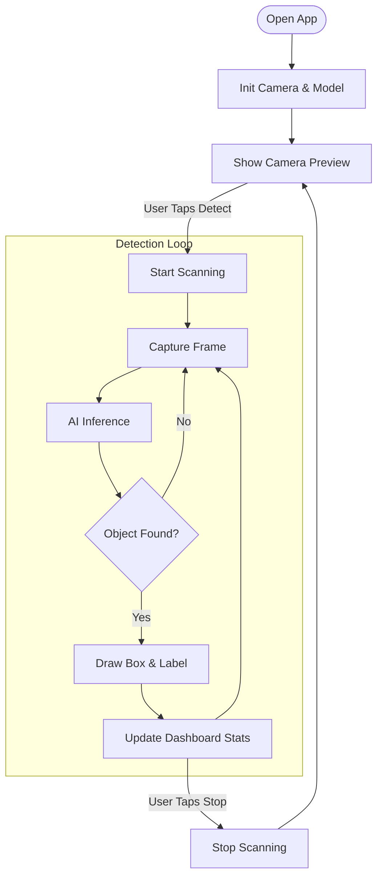

# ScanFix - Project Report

## 1. Objective
The primary objective of the **ScanFix** project was to develop a professional-grade, Android-native mobile application for real-time object detection. The application aimed to leverage on-device machine learning (TensorFlow Lite) to identify objects instantly through the camera feed without requiring an internet connection. Key goals included:
- Implementing a clean, modern UI with a cohesive dark theme.
- Achieving high-performance real-time detection using CameraX and TFLite.
- Providing insightful analytics (Total Detections, Average Confidence, Defect Rate) via a dedicated Dashboard.
- Allowing user configurability (Setting Confidence Thresholds) via a Settings page.

## 2. Findings
During the development of ScanFix, several key technical and design insights were discovered:
- **On-Device Inference**: TensorFlow Lite provides robust performance on modern Android devices, capable of running quantized MobileNet models at real-time frame rates (20+ FPS) on standard CPUs.
- **CameraX Efficiency**: The `ImageAnalysis` use case in CameraX is highly optimized for ML tasks. However, correct image rotation and buffer typings (YUV vs RGBA) are critical for accurate model input.
- **UI Architecture**: A single-activity architecture using Android Navigation Component simplifies state management between the Scan, Dashboard, and Settings screens compared to traditional multi-activity approaches.
- **Data Visualization**: Libraries like MPAndroidChart are essential for transforming raw detection data into meaningful user insights (e.g., confidence trends over time).

## 3. Project Challenges & Struggles
Developing ScanFix involved overcoming several significant hurdles:
- **Camera Orientation & Rotation**: One of the most persistent challenges was ensuring the camera frame was correctly oriented for the ML model. Android devices have varying sensor orientations, and mapping the detection coordinates back to the UI overlay required precise calculations.
- **Region of Interest (ROI)**: Initially, we attempted to crop the image to a central region for detection. This introduced complexity in coordinate mapping (scaling the bounding boxes back to the full screen view) and was eventually discarded in favor of full-screen detection for better UX.
- **Custom UI Implementation**: Achieving the specific "Dark Mint" aesthetic required deep customization of Material Components. Standard themes didn't fit the vision, necessitating manual overrides for colors, card strokes, and vector tinting.
- **State Management**: Sharing data (live detection counts and confidence scores) between the independent `ScanFragment` and `DashboardFragment` required implementing a robust `SharedViewModel` to ensure the dashboard updated in real-time even when not visible.

## 4. Conclusion
ScanFix successfully demonstrates the power of combining modern Android development practices (Kotlin, Jetpack Compose/Views, CameraX) with edge AI. The resulting application is not just a technical proof-of-concept but a polished user experience. It effectively detects objects, tracks performance metrics, and presents data in a visually appealing dark-themed interface. The project sets a strong foundation for future features like cloud synchronization, custom model training for specific defect types, or augmented reality overlays.

## 5. System Flowchart

